<p align="center">
  
</p>

<p align="center">
  <strong>Browserless HTML-to-PDF rendering engine for TypeScript and Bun.</strong><br/>
  <sub>HTML in. PDF out. No Chromium, no Playwright, no headless browser process.</sub>
</p>

<p align="center">
  <a href="#quickstart">= 1.2.0"/></a>
  <a href="#api"></a>
  <a href="#performance"></a>
  <a href="LICENSE"></a>
</p>

---

## Why

Most HTML-to-PDF stacks render through Chromium. That gives broad web compatibility, but it also brings browser startup, large binaries, and high memory use.

Html2PdfSmith is a different tradeoff: it is a document renderer for predictable printable HTML. It parses HTML, extracts a pragmatic CSS subset, lays out pages, and writes PDF directly through a streaming PDFKit pipeline.

| Area | Browser-based renderers | Html2PdfSmith |
|---|---:|---:|
| Runtime | Chromium / Playwright / Puppeteer | Bun + PDFKit |
| Memory model | Browser process per render or pool | Streaming PDF writer |
| Best fit | Arbitrary web pages | Reports, invoices, tables, branded PDFs |
| JavaScript execution | Yes | No |
| CSS scope | Browser CSS engine | Practical document CSS subset |
| Typical benchmark | Hundreds of MB RSS | ~46 MB incremental RSS for 10x100 table |

Html2PdfSmith is not trying to be a full browser. It is trying to be a small, controllable, production-friendly HTML-to-PDF engine.

## Features

- A4 and Letter pages
- portrait, landscape, and automatic orientation
- page headers, page footers, and streaming page numbers
- document headings, paragraphs, div/section text blocks, lists, blockquotes, pre/code blocks, links, horizontal rules
- inline rich text: `strong`, `b`, `em`, `i`, `u`, `s`, `del`, `span style`, `a href`, `code`
- block boxes with margins, padding, borders, background colors, and line-height
- tables with repeated headers, horizontal wide-table pagination, `thead`, `tbody`, `tfoot`, `colspan`, and basic `rowspan`
- table CSS: `border`, `border-width`, `border-color`, `padding`, `border-collapse: collapse`
- row and cell CSS: `background-color`, `color`, `font-size`, `font-weight`, `text-align`, `vertical-align`, `height`, `min-height`
- cell image CSS: `width`, `height`, `object-fit`, `object-position`
- cross-platform image transforms: `transform`, `transform-origin`, `-webkit-transform`, `-webkit-transform-origin`, `opacity`
- table layout controls: `colgroup`, `table-layout: fixed`, `white-space`, `text-overflow: ellipsis`
- per-side borders: `border-top`, `border-right`, `border-bottom`, `border-left`, dashed and dotted lines
- image support for PNG, JPEG, SVG, data URLs, local files, and HTTP(S) URLs
- PNG/JPEG natural aspect-ratio handling when only width or height is provided
- text and image watermarks
- custom font paths, font bytes, optional bundled fonts, optional Google Fonts disk cache, and optional system font discovery
- optional `qpdf` owner-password protection
- warnings API for non-fatal rendering issues

## Quickstart

```bash
bun add html2pdfsmith
```

```ts
import { renderHtmlToPdf } from "html2pdfsmith";

const pdf = await renderHtmlToPdf({
  html: `
    <!doctype html>
    <html>
      <body>
        <h1>Quarterly Report</h1>
        <p>Revenue increased compared with the previous quarter.</p>

        <table>
          <thead>
            <tr><th>Metric</th><th>Q1</th><th>Q2</th></tr>
          </thead>
          <tbody>
            <tr><td>Revenue</td><td>$1.2M</td><td>$1.4M</td></tr>
            <tr><td>Users</td><td>8,400</td><td>12,100</td></tr>
          </tbody>
        </table>
      </body>
    </html>
  `,
});

await Bun.write("report.pdf", pdf);
```

## Full Example

```ts
import { renderHtmlToPdfDetailed } from "html2pdfsmith";

const result = await renderHtmlToPdfDetailed({
  html,
  baseUrl: "./public",
  stylesheets: ["./pdf.css"],
  resourcePolicy: { allowHttp: false, allowFile: true },
  repeatHeaders: true,
  tableHeaderRepeat: "auto",
  text: { overflowWrap: "break-word" },
  page: { size: "A4", orientation: "landscape", marginMm: 4 },
  pageHeader: { text: "Quarterly Report", align: "right" },
  pageFooter: { text: "Generated by Html2PdfSmith", align: "left" },
  pageNumbers: { format: "Page {page}", align: "right" },
  watermarkText: "CONFIDENTIAL",
  watermarkOpacity: 12,
  watermarkLayer: "foreground",
  font: { googleFont: "Inter" },
});

console.log(result.pages, result.orientation, result.warnings);
await Bun.write("report.pdf", result.pdf);
```

## API

### `renderHtmlToPdf(options)`

Returns raw PDF bytes as `Uint8Array`.

```ts
const pdf = await renderHtmlToPdf({ html });
```

### `renderHtmlToPdfDetailed(options)`

Returns PDF bytes plus render metadata.

```ts
interface RenderHtmlToPdfResult {
  pdf: Uint8Array;
  warnings: RenderWarning[];
  pages: number;
  columns: number;
  orientation: "portrait" | "landscape";
}
```

### Options

| Option | Type | Description |
|---|---|---|
| `html` | `string` | HTML document string to render |
| `baseUrl` | `string` | Base URL or directory for relative assets such as CSS, images, SVGs, and fonts |
| `stylesheets` | `(string \| { href, content })[]` | Extra CSS files, URLs, or inline stylesheet content |
| `resourcePolicy` | `object` | Resource loading guardrails: HTTP/file/data access, timeout, max image/CSS bytes |
| `repeatHeaders` | `boolean` | Repeat table headers on page breaks |
| `tableHeaderRepeat` | `boolean \| "auto"` | Repeat table headers explicitly, or automatically for tables with headers |
| `table.rowspanPagination` | `"avoid" \| "split"` | Keep rowspan-connected rows together when they fit on a fresh page |
| `table.horizontalPagination` | `"none" \| "auto" \| "always"` | Split wide tables into several horizontal page slices |
| `table.horizontalPageColumns` | `number` | Maximum non-repeated source columns per horizontal slice |
| `table.repeatColumns` | `number` | Number of left-side source columns repeated in every horizontal slice |
| `text.overflowWrap` | `"normal" \| "break-word" \| "anywhere"` | Break long unspaced words/tokens instead of clipping them |
| `page.size` | `"A4" \| "LETTER"` | PDF page size |
| `page.orientation` | `"portrait" \| "landscape" \| "auto"` | Page orientation |
| `page.marginMm` | `number` | Page margin in millimeters |
| `pageHeader` | `{ text, align, fontSize, color, heightMm }` | Repeated page header |
| `pageFooter` | `{ text, align, fontSize, color, heightMm }` | Repeated page footer |
| `pageNumbers` | `boolean \| object` | Streaming page numbers, for example `Page {page}` |
| `watermarkText` | `string \| null` | Text watermark |
| `watermarkUrl` | `string \| null` | Image watermark |
| `watermarkOpacity` | `number` | Watermark opacity, `0..100` or `0..1` |
| `watermarkScale` | `number` | Watermark size scale |
| `watermarkLayer` | `"background" \| "foreground" \| "both"` | Draw watermark behind content, above content, or both |
| `patternType` | `string` | Watermark pattern hint |
| `userLogoUrl` | `string \| null` | Logo image for the document header |
| `font.googleFont` | `string` | Google Fonts family name, cached to disk |
| `font.googleFonts` | `string[]` | Additional Google Fonts selectable with CSS `font-family` |
| `font.bundled` | `PdfBundledFontFace` | Default offline font from an optional bundled-font package |
| `font.bundledFonts` | `PdfBundledFontFace[]` | Additional offline fonts selectable with CSS `font-family` |
| `font.regularPath` | `string` | Path to regular font |
| `font.boldPath` | `string` | Path to bold font |
| `font.italicPath` | `string` | Path to italic font |
| `font.boldItalicPath` | `string` | Path to bold italic font |
| `font.regularBytes` | `Uint8Array` | Regular font bytes |
| `font.boldBytes` | `Uint8Array` | Bold font bytes |
| `font.italicBytes` | `Uint8Array` | Italic font bytes |
| `font.boldItalicBytes` | `Uint8Array` | Bold italic font bytes |
| `font.autoDiscover` | `boolean` | Discover system fonts; convenient but heavier |
| `protectPdf` | `boolean` | Apply optional qpdf owner-password protection |
| `qpdfPath` | `string` | Custom qpdf binary path |
| `hideHeader` | `boolean` | Hide document brand/contact header |
| `onWarning` | `(warning) => void` | Receive non-fatal render warnings |

`{total}` page counts are intentionally not resolved by the default streaming renderer. Use `{page}` for low-memory page numbers. Total page counts require buffering pages or a second pass.

### Resource Loading

Use `baseUrl` when the HTML contains relative resources:

```ts
const result = await renderHtmlToPdfDetailed({
  html: `
    <link rel="stylesheet" href="assets/report.css">
    
  `,
  baseUrl: "/srv/app/public",
  resourcePolicy: {
    allowHttp: false,
    allowFile: true,
    allowData: true,
    timeoutMs: 8000,
    maxImageBytes: 5_000_000,
    maxStylesheetBytes: 500_000,
    maxFontBytes: 10_000_000,
  },
});
```

You can also pass stylesheets explicitly:

```ts
await renderHtmlToPdfDetailed({
  html,
  baseUrl: "./public",
  stylesheets: [
    "./pdf.css",
    { content: "table { border-collapse: collapse }" },
  ],
});
```

External CSS can declare fonts with `@font-face`. Font URLs are resolved relative to the stylesheet file, then loaded through the same resource policy:

```css
@font-face {
  font-family: "Report Sans";
  src: url("./fonts/ReportSans-Regular.ttf") format("truetype");
  font-weight: 400;
  font-style: normal;
}

@font-face {
  font-family: "Report Sans";
  src: url("./fonts/ReportSans-BoldItalic.ttf") format("truetype");
  font-weight: 700;
  font-style: italic;
}

body { font-family: "Report Sans"; }
```

## Supported HTML

Html2PdfSmith supports a document-oriented HTML subset:

- `html`, `head`, `body`
- `title`
- `header` with `.brand-name`
- `div`, `section`, `article`, `main`, `aside`
- `h1` through `h6`
- `p`, `address`, `blockquote`, `pre`, `code`
- `strong`, `b`, `em`, `i`, `u`, `s`, `del`, `span`, `a`
- `ul`, `ol`, `li`
- `table`, `thead`, `tbody`, `tfoot`, `tr`, `th`, `td`
- `img`, `hr`, `br`
- text nodes

Unsupported elements are traversed when possible. Unsupported CSS is ignored rather than failing the render.

## Supported CSS

The CSS support is intentionally pragmatic:

- selector support: tag, class, id, combined simple selectors, and descendant selectors such as `table td`
- `font-size`
- `font-weight`
- `color`
- `background-color`
- `text-align`
- `vertical-align: top`, `vertical-align: middle`, `vertical-align: bottom` for table cells
- `margin-top`
- `margin-bottom`
- `margin`, `margin-left`, `margin-right`
- `padding`, `padding-top`, `padding-right`, `padding-bottom`, `padding-left`
- `border`, `border-width`, `border-color`
- `border-style: solid`, `border-style: dashed`, `border-style: dotted`, `border-style: none`
- `border-top`, `border-right`, `border-bottom`, `border-left`
- `border-*-width`, `border-*-style`, `border-*-color`
- `line-height`
- `text-decoration`
- `border-collapse: collapse`
- `table-layout: fixed`
- `colgroup` / `col style="width: ..."` for table column widths
- `width`, `height` for images and tables
- `height`, `min-height` for table rows and cells
- `object-fit: contain`, `object-fit: cover`, `object-fit: fill` for images in table cells
- `object-position` keywords such as `left top`, `center center`, `right bottom`
- `opacity` for images
- `transform` and `-webkit-transform` for images: `rotate`, `scale`, `scaleX`, `scaleY`, `translate`, `translateX`, `translateY`
- `transform-origin` and `-webkit-transform-origin` for image transforms
- `display: none`
- `visibility: hidden`
- `page-break-before`, `page-break-after`, `break-before`, `break-after`
- `@page { size: A4 landscape; margin: 8mm }`
- `overflow-wrap: break-word`, `overflow-wrap: anywhere`, `word-break: break-word`, `word-break: break-all`
- `white-space: nowrap`, `white-space: pre-line`, `white-space: pre-wrap`
- `text-overflow: ellipsis` with `white-space: nowrap`
- `thead { display: table-header-group }` for repeated table headers on page breaks

Out of scope for now:

- arbitrary web pages
- JavaScript execution
- Flexbox and Grid
- fixed/absolute positioning
- CSS transforms and animations
- full browser-compatible cascade and layout

## Paged Documents

Html2PdfSmith supports a practical subset of CSS paged media:

```css
@page {
  size: A4 landscape;
  margin: 8mm;
}
```

Explicit API options still win when both are present:

```ts
await renderHtmlToPdfDetailed({
  html,
  page: { size: "A4", orientation: "landscape", marginMm: 8 },
});
```

Table headers can repeat on page breaks through API options or CSS:

```ts
await renderHtmlToPdfDetailed({
  html,
  tableHeaderRepeat: "auto",
  table: { rowspanPagination: "avoid" },
});
```

```css
thead {
  display: table-header-group;
}
```

Long unspaced tokens can be wrapped instead of clipped:

```ts
await renderHtmlToPdfDetailed({
  html,
  text: { overflowWrap: "break-word" },
});
```

```css
td {
  overflow-wrap: anywhere;
}
```

Tall table cells can align content horizontally and vertically:

```css
td.logo {
  height: 80px;
  text-align: center;
  vertical-align: middle;
}

td.logo img {
  width: 42px;
  height: 42px;
  object-fit: contain;
  object-position: center center;
}
```

Images can be transformed without relying on a browser engine:

```css
td.mirror img {
  transform: scaleX(-1);
  transform-origin: center center;
}

td.apple-template img {
  -webkit-transform: rotate(-18deg) scale(1.1);
  -webkit-transform-origin: center center;
  opacity: 0.65;
}
```

The `-webkit-*` aliases are parsed for Safari/Apple-authored templates, but the render path is the same cross-platform PDF transform engine on Windows, Linux, macOS, and Bun runtimes.

Tables can use fixed column widths and text overflow controls:

```html
<table>
  <colgroup>
    <col style="width: 90px">
    <col style="width: 180px">
    <col style="width: 35%">
    <col>
  </colgroup>
  ...
</table>
```

```css
table {
  table-layout: fixed;
}

td.vin {
  white-space: nowrap;
}

td.title {
  white-space: nowrap;
  overflow: hidden;
  text-overflow: ellipsis;
}

td.custom-border {
  border-left: 3px solid #2563eb;
  border-right: 2px dashed #d97706;
  border-bottom: 2px dotted #059669;
}
```

For merged table cells, the renderer groups rows connected by `rowspan` and keeps that group on one page whenever it fits on a fresh page. A section row immediately before a rowspan group, such as `<tr><td colspan="5">Section</td></tr>`, is kept with that group too. If the merged group is taller than a fresh page, Html2PdfSmith renders it sequentially and emits a warning instead of silently hiding the edge case.

Wide tables can be split horizontally without using a browser:

```ts
await renderHtmlToPdfDetailed({
  html,
  tableHeaderRepeat: "auto",
  table: {
    horizontalPagination: "always",
    horizontalPageColumns: 5,
    repeatColumns: 2,
    rowspanPagination: "avoid",
  },
});
```

With this mode Html2PdfSmith renders the table as multiple column slices. The first `repeatColumns` source columns are pinned on every slice, `thead` is repeated on every vertical page, rowspans keep their pagination behavior inside each slice, and body colspans push the horizontal break forward when they can fit in the current slice. If a body `colspan` is still too wide and crosses a horizontal slice boundary, the renderer clips it to the visible columns and emits a warning so the caller can decide whether the source table should be adjusted.

## Fonts

For Latin-only documents, the default built-in PDF fonts are the lightest option.

For production documents, prefer bundled fonts, explicit fonts, or Google Fonts.

Bundled fonts are best when production must render offline without first-run network downloads:

```ts
import { renderHtmlToPdfDetailed } from "html2pdfsmith";
import { bundledFonts } from "@html2pdfsmith/fonts";

const result = await renderHtmlToPdfDetailed({
  html,
  font: {
    bundled: bundledFonts.openSans,
    bundledFonts: [
      bundledFonts.ubuntu,
      bundledFonts.anton,
      bundledFonts.merriweather,
      bundledFonts.notoSans,
    ],
  },
});
```

Then CSS can select those families:

```css
h1 { font-family: "Anton"; }
td.note { font-family: "Ubuntu"; font-style: italic; }
td.body { font-family: "Open Sans"; }
```

The optional package currently includes Open Sans, Ubuntu, Anton, Roboto Condensed, Merriweather, and Noto Sans. It lives outside the core renderer so the main package stays small.

Google Fonts are useful when you do not want to vendor fonts:

```ts
const pdf = await renderHtmlToPdf({
  html,
  font: { googleFont: "Inter" },
});
```

Multiple Google Fonts can be preloaded and selected inside tables with CSS:

```ts
const result = await renderHtmlToPdfDetailed({
  html,
  font: {
    googleFont: "Inter",
    googleFonts: ["Roboto", "Lato", "Merriweather"],
  },
});
```

```css
th { font-family: "Inter"; font-weight: 700; text-align: center; }
td.left { font-family: "Roboto"; text-align: left; padding-left: 14px; }
td.center { font-family: "Lato"; text-align: center; font-size: 11pt; }
td.money { font-family: "Merriweather"; text-align: right; font-weight: 700; }
```

Google Fonts are downloaded on first use and cached to disk. Html2PdfSmith caches regular, bold, italic, and bold italic variants when the family provides them:

- Windows: `%LOCALAPPDATA%/html2pdfsmith/fonts`
- Linux/macOS: `$XDG_CACHE_HOME/html2pdfsmith/fonts` or `~/.cache/html2pdfsmith/fonts`
- Override: set `HTML2PDFSMITH_CACHE_DIR=/path/to/cache`

You can also pass explicit font files:

```ts
const pdf = await renderHtmlToPdf({
  html,
  font: {
    regularPath: "/fonts/NotoSans-Regular.ttf",
    boldPath: "/fonts/NotoSans-Bold.ttf",
  },
});
```

For low-memory production targets, avoid auto-discovering large CJK system fonts unless you need them.

## Performance

Current local benchmark on Windows/Bun for a 10-column, 100-row table with a text watermark:

```json
{
  "pages": 6,
  "ms": 118,
  "deltaPeakRssMb": 46.4
}
```

Run it locally:

```bash
bun run bench -- 10 100 --watermark
```

## Development

```bash
bun install
bun run typecheck
bun run smoke
bun run example
bun run example:css-table
bun run example:fonts
bun run example:bundled-fonts
bun run example:table-showcase
bun run example:resources
bun run example:font-face
bun run example:page-wrap-repeat
bun run example:merged-table
bun run example:wide-table
bun run example:alignment
bun run example:transform
bun run example:layout
bun run example:document
bun run bench -- 10 100 --watermark
```

## License

MIT
